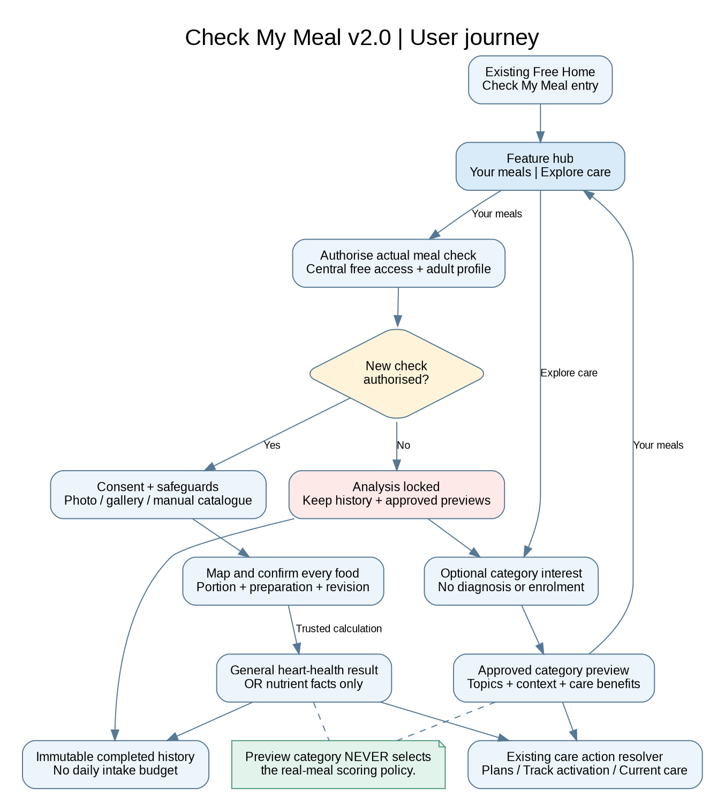
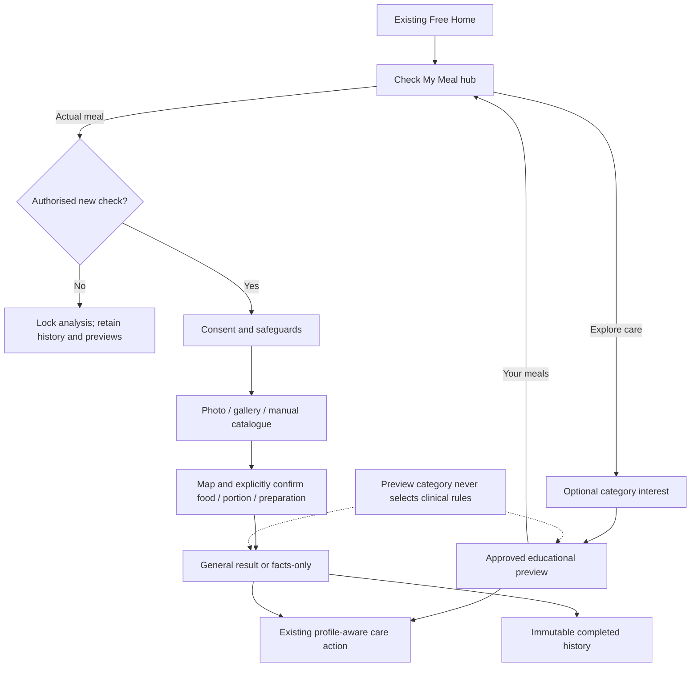
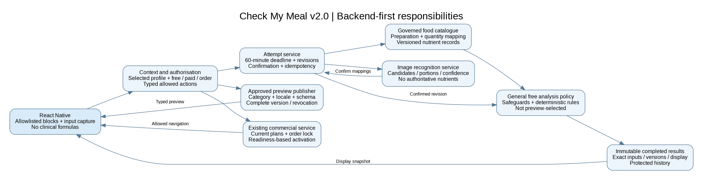
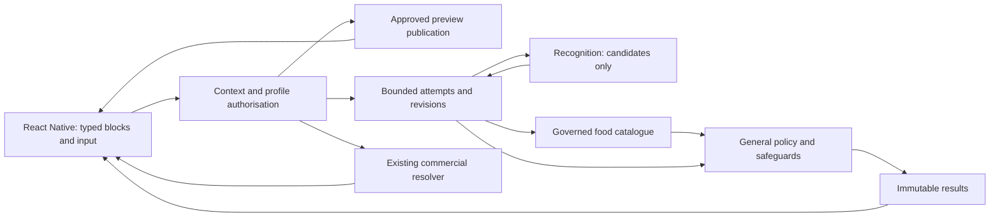
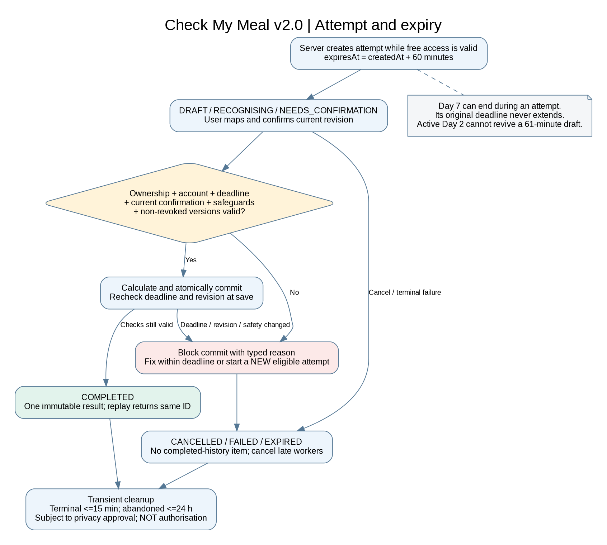
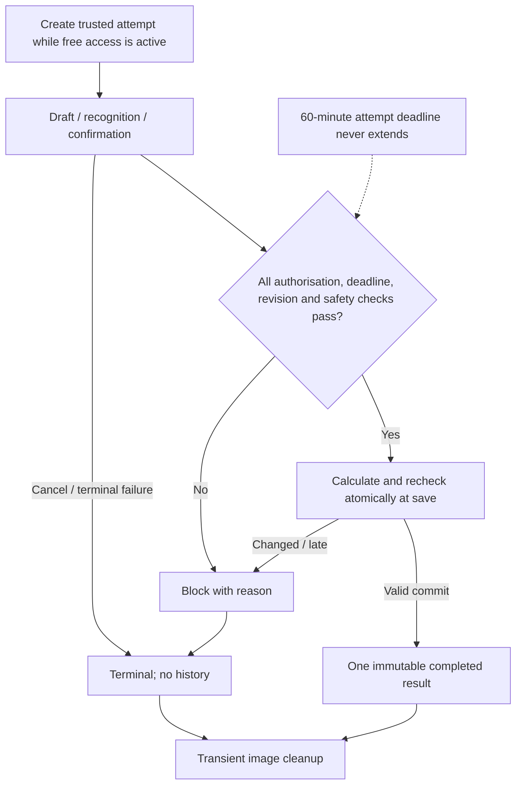

# User, backend and attempt workflows — v2.0

The diagrams describe the proposed feature, not existing production integrations. Read with the issue and backend contract.

## Two activities. No hidden clinical switch.

Editable: `Workflows/01_Two_Mode_User_Journey.mmd` (Mermaid) and `.dot` (Graphviz).

## Configuration changes content, not patient facts.

Editable: `Workflows/02_Backend_First_Responsibilities.mmd` (Mermaid) and `.dot` (Graphviz).

## The attempt deadline is independent of the programme timer.

Editable: `Workflows/03_Attempt_Expiry_and_Commit.mmd` (Mermaid) and `.dot` (Graphviz).

## Exceptions shared by both activities
Changing preview category refreshes the complete educational bundle only. Changes to the protected safety answers can change actual output mode; they do not change published preview content. Profile switching invalidates prior private requests. Pending order status changes only the commercial action and does not extend meal entitlement. Error recovery never introduces a demo result into personal history.

## Future paid extension
The same UI blocks, catalogue mapping and result storage can be reused. Patient-specific clinical selection, personal nutrient targets, multi-condition reconciliation, nutritionist operations and paid entitlements require their own scope, contracts and approvals. Do not turn them on by reusing the prototype name-matching function.
